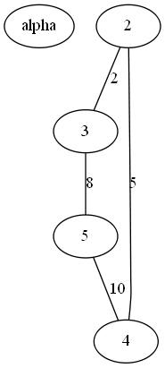
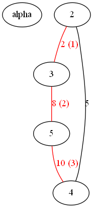

# About grago

Implementing some graph algorithms, `grago` is a package for Go.

### Setup

##### Prerequisites

Make sure you have a working Go installation with version `Go 1.1.x` or later.
See [Getting Started](http://golang.org/doc/install.html)

##### To Install
Run ```go get github.com/Alejandro131/grago```

### Examples

Before starting with the code, we have to import the `grago` package:
```import "github.com/Alejandro131/grago"```

##### Creating a graph

To create a graph, simply use the `NewGraph` function which accepts as arguments
3 boolean variables indicating whether the graph will be oriented, weighed and
if it is weighed, whether or not there can be negative edges. The following code
will create a graph that isn't oriented and is weighed with positive values only:
```graph := grago.NewGraph(false, true, false)```

##### Adding nodes and edges to it

To add a node or edges, use the functions `AddNode` and `AddLink` accordingly:
```
graph.AddNode("alpha")
graph.AddLink("2", "alpha", 2)
```
Adding a link which has a node (or 2 nodes) not previously added to the graph,
effectively adds the node to the graph, so you don't have to previously initialize
all the nodes and add the links later, but rather construct the graph from links.

##### Using algorithms on the structure

There are popular algorithms in graph theory problems which you can use on the graph
structure. Depending on the algorithm, you can expect differently formated output from
each of the functions. Below are several examples:

###### Breadth First Search

To see the results of the BFS algorithm, you specify a starting node and the function will
return a 2D slice with node names, representing the levels of the BFS traverse.
```
graph := grago.NewGraph(false, true, false)
graph.AddLink("2", "3", 2)
graph.AddLink("2", "4", 5)
graph.AddLink("3", "5", 8)
graph.AddLink("5", "4", 10)

fmt.Println(graph.BFS("2"))

// Output:
// [[2] [3 4] [5]]
```

###### Depth First Search

To see the results of the DFS algorithm, you specify a starting node and the function will
return a slice of **Link**s, representing the edges and nodes in the order they are traversed.
The string representation of a **Link** is ```start-(weight)->end```.
```
graph := grago.NewGraph(false, true, false)
graph.AddLink("2", "3", 2)
graph.AddLink("2", "4", 5)
graph.AddLink("3", "5", 8)
graph.AddLink("5", "4", 10)

fmt.Println(graph.DFS("2"))

// Output:
// [2-(2)->3 3-(8)->5 5-(10)->4]
```

###### Minimum distance between nodes

You can find the minimum distance between a node and other nodes via the `MinPaths` function
which returns a `map` with keys being node names and value the minimum distance to them.
```
graph := grago.NewGraph(false, true, false)
graph.AddLink("2", "3", 2)
graph.AddLink("2", "4", 5)
graph.AddLink("3", "5", 8)
graph.AddLink("5", "4", 10)

fmt.Println(graph.MinPaths("2")["5"])
fmt.Println(graph.MinPaths("3")["4"])

// Output:
// 10
// 7
```

###### Graph properties

Some graph properties can be checked in the package like whether the graph is planar.
```
graph := grago.NewGraph(false, true, false)
graph.AddNode("alpha")
graph.AddLink("2", "3", 2)
graph.AddLink("2", "4", 5)
graph.AddLink("3", "5", 8)
graph.AddLink("5", "4", 10)

fmt.Println(graph.IsPlanar())

graph.AddLink("2", "5", 20)
graph.AddLink("3", "4", 15)
graph.AddLink("2", "alpha", 1)
graph.AddLink("3", "alpha", 1)
graph.AddLink("4", "alpha", 1)
graph.AddLink("5", "alpha", 1)

fmt.Println(graph.IsPlanar())

// Output:
// true
// false
```

###### Other algorithms

For other available algorithms, look in the files of the package.

##### Exporting the graph to view in [Graphviz](http://www.graphviz.org/)

If you want to view the graph you have constructed visually, there is a function
which exports it to the `dot` language format supported by **Graphviz**. `Export` receives
as an argument a slice of **Link**s which you would like to be highlighted in the graph or
if you pass an empty slice, the function will return the plain graph. You also pass whether
or not you want the **Link**s to have an index attached to them so that you know the order
of traverse. Another option is to group the nodes in clusters which can be passed as a slice
of string slices.

###### Plain graph

```
graph := grago.NewGraph(false, true, false)
graph.AddNode("alpha")
graph.AddLink("2", "3", 2)
graph.AddLink("2", "4", 5)
graph.AddLink("3", "5", 8)
graph.AddLink("5", "4", 10)

fmt.Println(graph.Export([]Link{}, false, [][]string{}))

// Output:
// graph { "alpha" "2"--"3" [label="2"]; "2"--"4" [label="5"]; "3"--"5" [label="8"]; "5"--"4" [label="10"];}
```

If you pass the output to **Graphviz** this will be the resulting image:



###### Highlighted DFS path from node `2` in the graph

```
graph := grago.NewGraph(false, true, false)
graph.AddNode("alpha")
graph.AddLink("2", "3", 2)
graph.AddLink("2", "4", 5)
graph.AddLink("3", "5", 8)
graph.AddLink("5", "4", 10)

fmt.Println(graph.Export(graph.DFS("2"), true, [][]string{}))

// Output:
// graph { "alpha" "2"--"3" [label="2 (1)" fontcolor=red color=red]; "2"--"4" [label="5"]; "3"--"5" [label="8 (2)" fontcolor=red color=red]; "5"--"4" [label="10 (3)" fontcolor=red color=red];}
```

If you pass the output to **Graphviz** this will be the resulting image:



### License

The library is licensed under the [MIT License](LICENSE).